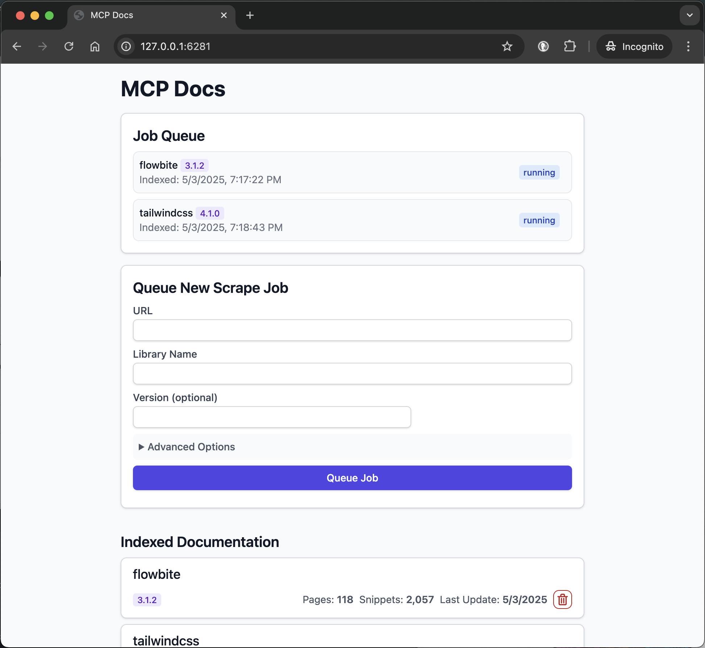

# Docs MCP Server: Your AI's Up-to-Date Documentation Expert

AI coding assistants often struggle with outdated documentation and hallucinations. The **Docs MCP Server** solves this by providing a personal, always-current knowledge base for your AI. It **indexes 3rd party documentation** from various sources (websites, GitHub, npm, PyPI, local files) and offers powerful, version-aware search tools via the Model Context Protocol (MCP).

This enables your AI agent to access the **latest official documentation**, dramatically improving the quality and reliability of generated code and integration details. It's **free**, **open-source**, runs **locally** for privacy, and integrates seamlessly into your development workflow.

## Why Use the Docs MCP Server?

LLM-assisted coding promises speed and efficiency, but often falls short due to:

- 🌀 **Stale Knowledge:** LLMs train on snapshots of the internet and quickly fall behind new library releases and API changes.
- 👻 **Code Hallucinations:** AI can invent plausible-looking code that is syntactically correct but functionally wrong or uses non-existent APIs.
- ❓ **Version Ambiguity:** Generic answers rarely account for the specific version dependencies in your project, leading to subtle bugs.
- ⏳ **Verification Overhead:** Developers spend valuable time double-checking AI suggestions against official documentation.

**Docs MCP Server solves these problems by:**

- ✅ **Providing Up-to-Date Context:** Fetches and indexes documentation directly from official sources (websites, GitHub, npm, PyPI, local files) on demand.
- 🎯 **Delivering Version-Specific Answers:** Search queries can target exact library versions, ensuring information matches your project's dependencies.
- 💡 **Reducing Hallucinations:** Grounds the LLM in real documentation for accurate examples and integration details.
- ⚡ **Boosting Productivity:** Get trustworthy answers faster, integrated directly into your AI assistant workflow.

## ✨ Key Features

- **Accurate & Version-Aware AI Responses:** Provides up-to-date, version-specific documentation to reduce AI hallucinations and improve code accuracy.
- **Broad Source Compatibility:** Scrapes documentation from websites, GitHub repos, package manager sites (npm, PyPI), and local file directories.
- **Advanced Search & Processing:** Intelligently chunks documentation semantically, generates embeddings, and combines vector similarity with full-text search.
- **Flexible Embedding Models:** Supports various providers including OpenAI (and compatible APIs), Google Gemini/Vertex AI, Azure OpenAI, and AWS Bedrock.
- **Enterprise Authentication:** Optional OAuth2/OIDC authentication with dynamic client registration for secure deployments.
- **Web Interface:** Easy-to-use web interface for searching and managing documentation.
- **Local & Private:** Runs entirely on your machine, ensuring data and queries remain private.
- **Free & Open Source:** Community-driven and freely available.
- **Simple Deployment:** Easy setup via Docker or `npx`.
- **Seamless Integration:** Works with MCP-compatible clients (like Claude, Cline, Roo).

> **What is semantic chunking?**
>
> Semantic chunking splits documentation into meaningful sections based on structure—like headings, code blocks, and tables—rather than arbitrary text size. Docs MCP Server preserves logical boundaries, keeps code and tables intact, and removes navigation clutter from HTML docs. This ensures LLMs receive coherent, context-rich information for more accurate and relevant answers.

## How to Run the Docs MCP Server

Choose your deployment method:

- [Standalone Server (Recommended)](#standalone-server-recommended)
- [Embedded Server](#embedded-server)
- [Advanced: Docker Compose (Scaling)](#advanced-docker-compose-scaling)

## Standalone Server (Recommended)

Run a standalone server that includes both MCP endpoints and web interface in a single process. This is the easiest way to get started.

### Option 1: Docker

1. **Install Docker.**
2. **Start the server:**

   ```bash
   docker run --rm \
     -e OPENAI_API_KEY="your-openai-api-key" \
     -v docs-mcp-data:/data \
     -p 6280:6280 \
     ghcr.io/arabold/docs-mcp-server:latest \
     --protocol http --port 6280
   ```

   Replace `your-openai-api-key` with your actual OpenAI API key.

### Option 2: npx

1. **Install Node.js 22.x or later.**
2. **Start the server:**

   ```bash
   OPENAI_API_KEY="your-openai-api-key" npx @arabold/docs-mcp-server@latest
   ```

   Replace `your-openai-api-key` with your actual OpenAI API key.

   This will run the server on port 6280 by default.

### Configure Your MCP Client

Add this to your MCP settings (VS Code, Claude Desktop, etc.):

```json
{
  "mcpServers": {
    "docs-mcp-server": {
      "type": "sse",
      "url": "http://localhost:6280/sse",
      "disabled": false,
      "autoApprove": []
    }
  }
}
```

**Alternative connection types:**

```jsonc
// SSE (Server-Sent Events)
"type": "sse", "url": "http://localhost:6280/sse"

// HTTP (Streamable)
"type": "http", "url": "http://localhost:6280/mcp"
```

Restart your AI assistant after updating the config.

### Access the Web Interface

Open `http://localhost:6280` in your browser to manage documentation and monitor jobs.

### CLI Usage with Standalone Server

You can also use CLI commands to interact with the local database:

```bash
# List indexed libraries
OPENAI_API_KEY="your-key" npx @arabold/docs-mcp-server@latest list

# Search documentation
OPENAI_API_KEY="your-key" npx @arabold/docs-mcp-server@latest search react "useState hook"

# Scrape new documentation (connects to running server's worker)
npx @arabold/docs-mcp-server@latest scrape react https://react.dev/reference/react --server-url http://localhost:6280/api
```

### Adding Library Documentation

1. Open the Web Interface at `http://localhost:6280`.
2. Use the "Queue New Scrape Job" form.
3. Enter the documentation URL, library name, and (optionally) version.
4. Click "Queue Job". Monitor progress in the Job Queue.
5. Repeat for each library you want indexed.

Once a job completes, the docs are searchable via your AI assistant or the Web UI.



**Benefits:**

- Single command setup with both web UI and MCP server
- Persistent data storage (Docker volume or local directory)
- No repository cloning required
- Full feature access including web interface

To stop the server, press `Ctrl+C`.

## Embedded Server

Run the MCP server directly embedded in your AI assistant without a separate process or web interface. This method provides MCP integration only.

### Configure Your MCP Client

Add this to your MCP settings (VS Code, Claude Desktop, etc.):

```json
{
  "mcpServers": {
    "docs-mcp-server": {
      "command": "npx",
      "args": ["@arabold/docs-mcp-server@latest"],
      "env": {
        "OPENAI_API_KEY": "sk-proj-..." // Your OpenAI API key
      },
      "disabled": false,
      "autoApprove": []
    }
  }
}
```

Replace `sk-proj-...` with your OpenAI API key and restart your application.

### Adding Library Documentation

**Option 1: Use MCP Tools**

Your AI assistant can index new documentation using the built-in `scrape_docs` tool:

```
Please scrape the React documentation from https://react.dev/reference/react for library "react" version "18.x"
```

**Option 2: Launch Web Interface**

Start a temporary web interface that shares the same database:

```bash
OPENAI_API_KEY="your-key" npx @arabold/docs-mcp-server@latest web --port 6281
```

Then open `http://localhost:6281` to manage documentation. Stop the web interface when done (`Ctrl+C`).

**Option 3: CLI Commands**

Use CLI commands directly (avoid running scrape jobs concurrently with embedded server):

```bash
# List libraries
OPENAI_API_KEY="your-key" npx @arabold/docs-mcp-server@latest list

# Search documentation
OPENAI_API_KEY="your-key" npx @arabold/docs-mcp-server@latest search react "useState hook"
```

**Benefits:**

- Direct integration with AI assistant
- No separate server process required
- Persistent data storage in user's home directory
- Shared database with standalone server and CLI

**Limitations:**

- No web interface (unless launched separately)
- Documentation indexing requires MCP tools or separate commands

## Scraping Local Files and Folders

You can index documentation from your local filesystem by using a `file://` URL as the source. This works in both the Web UI and CLI.

**Examples:**

- Web: `https://react.dev/reference/react`
- Local file: `file:///Users/me/docs/index.html`
- Local folder: `file:///Users/me/docs/my-library`

**Requirements:**

- All files with a MIME type of `text/*` are processed. This includes HTML, Markdown, plain text, and source code files such as `.js`, `.ts`, `.tsx`, `.css`, etc. Binary files, PDFs, images, and other non-text formats are ignored.
- You must use the `file://` prefix for local files/folders.
- The path must be accessible to the server process.
- **If running in Docker:**
  - You must mount the local folder into the container and use the container path in your `file://` URL.
  - Example Docker run:
    ```bash
    docker run --rm \
      -e OPENAI_API_KEY="your-key" \
      -v /absolute/path/to/docs:/docs:ro \
      -v docs-mcp-data:/data \
      ghcr.io/arabold/docs-mcp-server:latest \
      scrape mylib file:///docs/my-library
    ```
  - In the Web UI, enter the path as `file:///docs/my-library` (matching the container path).

See the tooltips in the Web UI and CLI help for more details.

## Advanced: Docker Compose (Scaling)

For production deployments or when you need to scale processing, use Docker Compose to run separate services. The system selects a local in-process worker or a remote worker client based on configuration, keeping behavior consistent across modes.

**Start the services:**

```bash
# Clone the repository (to get docker-compose.yml)
git clone https://github.com/arabold/docs-mcp-server.git
cd docs-mcp-server

# Set your environment variables
export OPENAI_API_KEY="your-key-here"

# Start all services
docker compose up -d

# Scale workers if needed
docker compose up -d --scale worker=3
```

**Service architecture:**

- **Worker** (port 8080): Handles documentation processing jobs
- **MCP Server** (port 6280): Provides `/sse` endpoint for AI tools
- **Web Interface** (port 6281): Browser-based management interface

**Configure your MCP client:**

```json
{
  "mcpServers": {
    "docs-mcp-server": {
      "type": "sse",
      "url": "http://localhost:6280/sse",
      "disabled": false,
      "autoApprove": []
    }
  }
}
```

**Alternative connection types:**

```json
// SSE (Server-Sent Events)
"type": "sse", "url": "http://localhost:6280/sse"

// HTTP (Streamable)
"type": "http", "url": "http://localhost:6280/mcp"
```

**Access interfaces:**

- Web Interface: `http://localhost:6281`
- MCP Endpoint (HTTP): `http://localhost:6280/mcp`
- MCP Endpoint (SSE): `http://localhost:6280/sse`

This architecture allows independent scaling of processing (workers) and user interfaces.

## Configuration

Commands that perform search or indexing operations require embedding configuration to be explicitly set via environment variables.

The Docs MCP Server is configured via environment variables. Set these in your shell, Docker, or MCP client config.

| Variable                           | Description                                           |
| ---------------------------------- | ----------------------------------------------------- |
| `DOCS_MCP_EMBEDDING_MODEL`         | Embedding model to use (see below for options).       |
| `OPENAI_API_KEY`                   | OpenAI API key for embeddings.                        |
| `OPENAI_API_BASE`                  | Custom OpenAI-compatible API endpoint (e.g., Ollama). |
| `GOOGLE_API_KEY`                   | Google API key for Gemini embeddings.                 |
| `GOOGLE_APPLICATION_CREDENTIALS`   | Path to Google service account JSON for Vertex AI.    |
| `AWS_ACCESS_KEY_ID`                | AWS key for Bedrock embeddings.                       |
| `AWS_SECRET_ACCESS_KEY`            | AWS secret for Bedrock embeddings.                    |
| `AWS_REGION`                       | AWS region for Bedrock.                               |
| `AZURE_OPENAI_API_KEY`             | Azure OpenAI API key.                                 |
| `AZURE_OPENAI_API_INSTANCE_NAME`   | Azure OpenAI instance name.                           |
| `AZURE_OPENAI_API_DEPLOYMENT_NAME` | Azure OpenAI deployment name.                         |
| `AZURE_OPENAI_API_VERSION`         | Azure OpenAI API version.                             |

See [examples above](#alternative-using-docker) for usage.

### Embedding Model Options

Set `DOCS_MCP_EMBEDDING_MODEL` to one of:

- `text-embedding-3-small` (default, OpenAI)
- `openai:snowflake-arctic-embed2` (OpenAI-compatible, Ollama)
- `vertex:text-embedding-004` (Google Vertex AI)
- `gemini:embedding-001` (Google Gemini)
- `aws:amazon.titan-embed-text-v1` (AWS Bedrock)
- `microsoft:text-embedding-ada-002` (Azure OpenAI)
- Or any OpenAI-compatible model name

### Provider-Specific Configuration Examples

Here are complete configuration examples for different embedding providers:

**OpenAI (Default):**

```bash
OPENAI_API_KEY="sk-proj-your-openai-api-key" \
DOCS_MCP_EMBEDDING_MODEL="text-embedding-3-small" \
npx @arabold/docs-mcp-server@latest
```

**Ollama (Local):**

```bash
OPENAI_API_KEY="ollama" \
OPENAI_API_BASE="http://localhost:11434/v1" \
DOCS_MCP_EMBEDDING_MODEL="nomic-embed-text" \
npx @arabold/docs-mcp-server@latest
```

**LM Studio (Local):**

```bash
OPENAI_API_KEY="lmstudio" \
OPENAI_API_BASE="http://localhost:1234/v1" \
DOCS_MCP_EMBEDDING_MODEL="text-embedding-qwen3-embedding-4b" \
npx @arabold/docs-mcp-server@latest
```

**Google Gemini:**

```bash
GOOGLE_API_KEY="your-google-api-key" \
DOCS_MCP_EMBEDDING_MODEL="gemini:embedding-001" \
npx @arabold/docs-mcp-server@latest
```

**Google Vertex AI:**

```bash
GOOGLE_APPLICATION_CREDENTIALS="/path/to/your/gcp-service-account.json" \
DOCS_MCP_EMBEDDING_MODEL="vertex:text-embedding-004" \
npx @arabold/docs-mcp-server@latest
```

**AWS Bedrock:**

```bash
AWS_ACCESS_KEY_ID="your-aws-access-key-id" \
AWS_SECRET_ACCESS_KEY="your-aws-secret-access-key" \
AWS_REGION="us-east-1" \
DOCS_MCP_EMBEDDING_MODEL="aws:amazon.titan-embed-text-v1" \
npx @arabold/docs-mcp-server@latest
```

**Azure OpenAI:**

```bash
AZURE_OPENAI_API_KEY="your-azure-openai-api-key" \
AZURE_OPENAI_API_INSTANCE_NAME="your-instance-name" \
AZURE_OPENAI_API_DEPLOYMENT_NAME="your-deployment-name" \
AZURE_OPENAI_API_VERSION="2024-02-01" \
DOCS_MCP_EMBEDDING_MODEL="microsoft:text-embedding-ada-002" \
npx @arabold/docs-mcp-server@latest
```

For more architectural details, see the [ARCHITECTURE.md](ARCHITECTURE.md).

For enterprise authentication and security features, see the [Authentication Guide](docs/authentication.md).

## Telemetry

The Docs MCP Server includes privacy-first telemetry to help improve the product. We collect anonymous usage data to understand how the tool is used and identify areas for improvement.

### What We Collect

- Command usage patterns and success rates
- Tool execution metrics (counts, durations, error types)
- Pipeline job statistics (progress, completion rates)
- Service configuration patterns (auth enabled, read-only mode)
- Performance metrics (response times, processing efficiency)
- Protocol usage (stdio vs HTTP, transport modes)

### What We DON'T Collect

- Search query content or user input
- URLs being scraped or accessed
- Document content or scraped data
- Authentication tokens or credentials
- Personal information or identifying data

### Disabling Telemetry

You can disable telemetry collection entirely:

**Option 1: CLI Flag**

```bash
npx @arabold/docs-mcp-server@latest --no-telemetry
```

**Option 2: Environment Variable**

```bash
DOCS_MCP_TELEMETRY=false npx @arabold/docs-mcp-server@latest
```

**Option 3: Docker**

```bash
docker run -e DOCS_MCP_TELEMETRY=false ghcr.io/arabold/docs-mcp-server:latest
```

For more details about our telemetry practices, see the [Telemetry Guide](docs/telemetry.md).

## Development

To develop or contribute to the Docs MCP Server:

- Fork the repository and create a feature branch.
- Follow the code conventions in [ARCHITECTURE.md](ARCHITECTURE.md).
- Write clear commit messages (see Git guidelines above).
- Open a pull request with a clear description of your changes.

For questions or suggestions, open an issue.

### Architecture

For details on the project's architecture and design principles, please see [ARCHITECTURE.md](ARCHITECTURE.md).

_Notably, the vast majority of this project's code was generated by the AI assistant Cline, leveraging the capabilities of this very MCP server._

## License

This project is licensed under the MIT License. See [LICENSE](LICENSE) for details.
