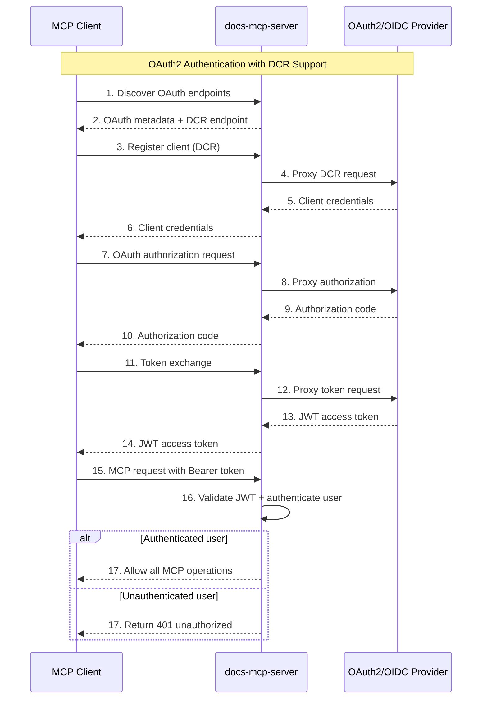

# OAuth2 Authentication

## Overview

The Docs MCP Server supports optional OAuth2 authentication for HTTP endpoints, providing enterprise-grade security while maintaining a frictionless local development experience. Authentication is disabled by default and uses a binary authentication model for maximum compatibility with OAuth2 providers.

**Important**: The Docs MCP Server is an **OAuth2 protected resource**, not an OAuth2 authorization server. It relies on external OAuth2 providers (such as Auth0, Clerk, Keycloak, or Azure AD) for authentication and authorization. The server validates JWT tokens issued by these providers but does not issue tokens itself.

## Architecture

The authentication system uses a **binary authentication model** with OAuth2 proxy support, providing secure access control while maintaining compatibility with any RFC 6749 compliant OAuth2 provider.

**Architecture Overview**: The Docs MCP Server acts as an OAuth2 **protected resource** that validates JWT access tokens issued by external OAuth2 providers. It implements an OAuth2 proxy to enable Dynamic Client Registration (DCR) for MCP clients like VS Code, while using standard OAuth identity scopes for maximum provider compatibility.

### Binary Authentication Model

The system implements a simplified binary access control model:

- **Authenticated Users** - Full access to all MCP tools and endpoints
- **Unauthenticated Users** - No access (401 responses)

This approach eliminates complex scope management while maintaining security, ensuring broad compatibility with OAuth2 providers that may not support custom scopes for DCR workflows.

### OAuth2 Proxy with DCR Support

The server includes a built-in OAuth2 proxy that enables seamless integration with MCP clients:

- **Dynamic Client Registration (DCR)** - RFC 7591 compliant automatic client registration
- **Resource Parameter Support** - RFC 8707 compliant multi-transport resource identification
- **Multi-Transport Detection** - Automatic resource URL detection for SSE and HTTP transports
- **Standard OAuth Flows** - Authorization Code, Client Credentials, and refresh token support
- **Smart Discovery** - Uses OAuth2 authorization server discovery (RFC 8414) for comprehensive endpoint detection including DCR and JWKS

### Authentication Flow



## Configuration

Authentication is configured by pointing the Docs MCP Server to your external OAuth2/OIDC provider. Configure through CLI arguments, environment variables, or configuration files with the following precedence: CLI flags > environment variables > defaults.

**Setup Steps**:

1. **Set up your OAuth2 provider** (Auth0, Clerk, Keycloak, etc.) with standard OAuth identity scopes
2. **Configure the Docs MCP Server** to validate tokens from that provider using the settings below

### CLI Arguments

```bash
# Configure Docs MCP Server to validate tokens from your OAuth2/OIDC provider
npx docs-mcp-server
  --auth-enabled
  --auth-issuer-url "https://auth.your-domain.com"
  --auth-audience "https://mcp.your-domain.com"
```

### Environment Variables

```bash
# Configure Docs MCP Server via environment variables
export DOCS_MCP_AUTH_ENABLED=true
export DOCS_MCP_AUTH_ISSUER_URL="https://auth.your-domain.com"
export DOCS_MCP_AUTH_AUDIENCE="https://mcp.your-domain.com"
```

### Configuration Options

| Option      | CLI Flag            | Environment Variable       | Description                                             |
| ----------- | ------------------- | -------------------------- | ------------------------------------------------------- |
| Enable Auth | `--auth-enabled`    | `DOCS_MCP_AUTH_ENABLED`    | Enable OAuth2 token validation                          |
| Issuer URL  | `--auth-issuer-url` | `DOCS_MCP_AUTH_ISSUER_URL` | OAuth2 discovery endpoint of your external provider     |
| Audience    | `--auth-audience`   | `DOCS_MCP_AUTH_AUDIENCE`   | JWT audience claim (identifies this protected resource) |

## OAuth2 Setup

The Docs MCP Server supports OAuth2 authentication for securing MCP endpoints. Token validation is handled through standard JWT validation using the provider's public keys (JWKS).

**Note**: You must configure an external OAuth2 provider (such as Clerk, Auth0, Keycloak, or Azure AD) before enabling authentication. The Docs MCP Server validates JWT tokens but does not issue them.

### How It Works

OAuth2 authentication uses the DCR flow shown above, where the server acts as an OAuth2 proxy to enable seamless MCP client integration. For clients that already have tokens, they can skip the registration and authorization steps and directly make authenticated MCP requests.

### Server Configuration

To enable OAuth2 authentication, configure the Docs MCP Server to connect to your OAuth2 provider:

```bash
# Configure Docs MCP Server to validate tokens from your OAuth2 provider
npx docs-mcp-server
  --auth-enabled
  --auth-issuer-url "https://your-provider.example.com"
  --auth-audience "https://mcp.your-domain.com"
```

### OAuth2 Provider Setup

**Prerequisite**: You must first set up an OAuth2/OIDC provider separately. The following examples show how to configure popular providers to work with the Docs MCP Server.

#### Example Provider Configurations

**Auth0**:

```bash
npx docs-mcp-server
  --auth-enabled
  --auth-issuer-url "https://your-tenant.auth0.com"
  --auth-audience "https://mcp.your-domain.com"
```

**Clerk**:

```bash
npx docs-mcp-server
  --auth-enabled
  --auth-issuer-url "https://your-app.clerk.accounts.dev"
  --auth-audience "https://mcp.your-domain.com"
```

**Keycloak**:

```bash
npx docs-mcp-server
  --auth-enabled
  --auth-issuer-url "https://keycloak.your-domain.com/auth/realms/your-realm"
  --auth-audience "https://mcp.your-domain.com"
```

**Azure AD**:

```bash
npx docs-mcp-server
  --auth-enabled
  --auth-issuer-url "https://login.microsoftonline.com/your-tenant-id/v2.0"
  --auth-audience "https://mcp.your-domain.com"
```

For providers that use JWT tokens, ensure your JWT template/claims include the resource ID as the audience claim.

### OAuth2 Endpoints

The server exposes OAuth2 proxy endpoints for Dynamic Client Registration and standard OAuth flows:

- **`/.well-known/oauth-authorization-server`** - OAuth2 discovery metadata
- **`/oauth/register`** - Dynamic Client Registration (DCR) endpoint
- **`/oauth/authorize`** - Authorization endpoint (proxied to provider)
- **`/oauth/token`** - Token endpoint (proxied to provider)
- **`/oauth/revoke`** - Token revocation (proxied to provider)

### Protected Resource Metadata

The server exposes RFC 9728 compliant metadata at `/.well-known/oauth-protected-resource`:

```json
{
  "resource": "https://mcp.your-domain.com",
  "authorization_servers": ["https://your-provider.example.com"],
  "scopes_supported": ["openid", "profile", "email"],
  "resource_name": "Documentation MCP Server",
  "resource_documentation": "https://github.com/arabold/docs-mcp-server#readme",
  "bearer_methods_supported": ["header"]
}
```

### MCP Client Integration

MCP clients can authenticate using standard OAuth2 flows with DCR support:

1. **Discovery**: Fetch `/.well-known/oauth-authorization-server` for OAuth2 metadata
2. **Registration**: Use DCR endpoint to automatically register client credentials
3. **Authentication**: Obtain JWT token using OAuth2 Authorization Code flow
4. **API Access**: Include `Authorization: Bearer <token>` header in MCP requests

**Dynamic Client Registration**: The Docs MCP Server supports RFC 7591 compliant DCR, enabling MCP clients like VS Code to automatically register and obtain authorization without manual client configuration. The DCR workflow is proxied to your OAuth2 provider with resource parameter support for multi-transport scenarios.

## Binary Access Control

All authenticated users receive full access to all MCP tools and endpoints. The system does not implement granular permissions or role-based access control.

### Available MCP Tools

All tools are available to authenticated users:

#### Documentation Operations

- `list_libraries` - List indexed documentation libraries
- `search_docs` - Search within documentation
- `fetch_url` - Retrieve content from URLs
- `find_version` - Find library version information

#### Content Management

- `scrape_docs` - Index new documentation content
- `remove_docs` - Remove indexed documentation

#### Job Management

- `get_job_info` - View job status and details
- `list_jobs` - List processing jobs
- `cancel_job` - Cancel running jobs
- `clear_completed_jobs` - Clean up completed jobs

## Security Features

### JWT Validation

- **Signature Verification**: Cryptographic validation using provider's public keys from JWKS endpoint
- **Claim Validation**: Issuer, audience, and expiration time verification
- **Binary Authentication**: Simple authenticated/unauthenticated access control

### Error Handling

- **401 Unauthorized**: Missing, invalid, or expired authentication token
- **WWW-Authenticate Header**: RFC 6750 compliant challenge responses
- **Detailed Error Messages**: Clear feedback for authentication failures

### Fail-Safe Design

- **Disabled by Default**: No authentication required for local development
- **Graceful Degradation**: Invalid configuration logs errors but doesn't crash
- **Provider Independence**: Works with any RFC 6749 compliant OAuth2 provider

## Usage Examples

### Development (No Auth)

```bash
# Start server without authentication
npx docs-mcp-server --port 6280
```

### Production with Auth

```bash
# Configure Docs MCP Server to validate tokens from your OAuth2 provider
npx docs-mcp-server
  --port 6280
  --auth-enabled
  --auth-issuer-url "https://keycloak.your-domain.com/realms/api"
  --auth-audience "https://docs-mcp.your-domain.com"
```

### Client Authentication

```javascript
// Obtain token from your OAuth2 provider
const token = await getAccessToken();

// Use token in requests
const response = await fetch("http://localhost:6280/mcp", {
  method: "POST",
  headers: {
    Authorization: `Bearer ${token}`,
    "Content-Type": "application/json",
  },
  body: JSON.stringify({
    jsonrpc: "2.0",
    method: "search_docs",
    params: { library: "react", query: "hooks" },
    id: 1,
  }),
});
```

## Integration Patterns

### OAuth2 Providers

The Docs MCP Server works with any RFC 6749 compliant OAuth2 provider as an external authentication service. You must set up one of these providers separately:

- **Auth0**: Use tenant domain as provider URL
- **Keycloak**: Use realm-specific issuer URL
- **Azure AD**: Use tenant-specific v2.0 endpoint
- **Google**: Use Google's OAuth2 endpoints
- **Clerk**: Use your Clerk domain for provider URL
- **Custom**: Any provider supporting JWT access tokens

The Docs MCP Server validates tokens issued by these providers but does not replace them.

#### Provider Configuration Examples

**Auth0**:

```bash
npx docs-mcp-server
  --auth-enabled
  --auth-issuer-url "https://your-tenant.auth0.com"
  --auth-audience "https://mcp.your-domain.com"
```

**Clerk**:

```bash
npx docs-mcp-server
  --auth-enabled
  --auth-issuer-url "https://your-app.clerk.accounts.dev"
  --auth-audience "https://mcp.your-domain.com"
```

**Provider-Specific JWT Configuration:**
Configure your provider's JWT template/claims to include the resource ID as the audience claim. For example, with Clerk:

```json
{
  "aud": "https://mcp.your-domain.com",
  "sub": "{{user.id}}",
  "email": "{{user.primaryEmailAddress.emailAddress}}",
  "name": "{{user.fullName}}"
}
```

**Resource ID Requirements:**

- Must be a valid URI (URL or URN)
- **URL examples**: `https://mcp.your-domain.com`, `http://localhost:6280` (dev only)
- **URN examples**: `urn:docs-mcp-server:api`, `urn:company:service`
- Used as the JWT audience claim for validation
- Should be unique and not conflict with your actual server URL

### API Gateway Integration

When deployed behind an API gateway with authentication:

1. Configure the gateway to validate tokens
2. Forward validated requests with user context
3. Optionally disable server-side auth validation for trusted gateways
4. Ensure proper request forwarding for OAuth2 proxy endpoints

## Troubleshooting

### Common Issues

**401 Unauthorized**

- Check token is included in Authorization header
- Verify token hasn't expired
- Confirm provider URL and resource ID configuration
- Ensure resource ID matches the JWT audience claim

**DCR Registration Failures**

- Verify OAuth2 provider supports Dynamic Client Registration
- Check provider DCR endpoint is accessible
- Ensure provider allows the requested redirect URIs
- Review provider logs for DCR-specific errors

**500 Internal Server Error**

- Check provider discovery endpoint is accessible
- Verify provider URL configuration
- Review server logs for detailed error messages
- Ensure provider JWKS endpoint is reachable

### Debug Logging

Enable debug logging to troubleshoot authentication issues:

```bash
DEBUG=mcp:auth npx docs-mcp-server --auth-enabled --auth-issuer-url "..."
```

## Security Considerations

### Token Security

- Use HTTPS in production environments
- Implement proper token storage in clients
- Consider token refresh strategies for long-running operations
- Monitor token expiration and handle renewal

### Network Security

- Deploy behind TLS termination
- Consider API rate limiting
- Implement proper CORS policies for web clients
- Use secure OAuth2 flows (Authorization Code with PKCE)

### Access Control

- All authenticated users receive full access to all endpoints
- Consider additional authorization layers if granular permissions are required
- Monitor user activity and implement audit logging
- Regularly review OAuth2 provider user access and permissions
