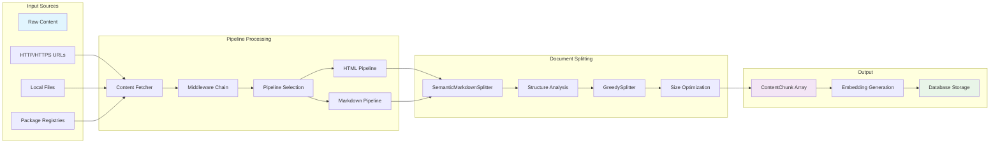

# Content Processing

## Overview

The content processing system transforms raw content from various sources into searchable document chunks through a modular pipeline architecture.

## Content Sources

### Web Sources

- HTTP/HTTPS URLs with JavaScript rendering support
- Playwright-based scraping for dynamic content
- Configurable depth and page limits
- Respect for robots.txt and rate limiting

### Local Files

- `file://` protocol for local filesystem access
- Recursive directory processing
- MIME type detection for content routing
- Support for HTML, Markdown, and text files

### Package Registries

- npm registry documentation extraction
- PyPI package documentation
- Version-specific documentation retrieval
- Package metadata integration

## Processing Pipeline

### Fetcher Layer

Abstracts content retrieval across sources:

**HttpFetcher:**

- Handles web content with Playwright
- JavaScript execution and DOM rendering
- Cookie and session management
- Retry logic and error handling

**FileFetcher:**

- Local filesystem access
- MIME type detection
- Directory traversal with filtering
- File encoding detection

### Middleware Chain

Content transforms through ordered middleware:

1. **Content Parser**: HTML/Markdown parsing
2. **Metadata Extractor**: Title, description, timestamps
3. **Link Processor**: Internal link resolution
4. **Content Cleaner**: Remove navigation, ads, boilerplate
5. **Structure Normalizer**: Consistent heading hierarchy

### Pipeline Selection

Content routes to appropriate pipeline based on MIME type:

**HtmlPipeline:**

- DOM parsing and structure extraction
- Navigation removal and content isolation
- Link context preservation
- Metadata extraction from HTML tags

**MarkdownPipeline:**

- Markdown parsing and structure analysis
- Code block preservation
- Link and reference processing
- Front matter extraction

## Content Transformation

### HTML Processing

1. Parse DOM structure using Playwright
2. Remove navigation elements and ads
3. Extract main content areas
4. Preserve code blocks and tables
5. Convert to clean Markdown format

### Markdown Processing

1. Parse Markdown AST
2. Extract front matter metadata
3. Process code blocks and tables
4. Resolve relative links
5. Normalize heading structure

### Metadata Extraction

Common metadata across content types:

- Document title and description
- Creation and modification timestamps
- Author information
- Version and library association
- URL and source context

## Content Processing Flow

Content follows a structured pipeline from raw input to searchable chunks:



### Phase 1: Content Normalization

- **Input**: Raw HTML, Markdown, or other formats
- **Processing**: Pipeline-specific transformation to clean Markdown
- **Output**: Normalized Markdown with preserved structure

### Phase 2: Semantic Structure Analysis

- **Input**: Clean Markdown content
- **Processing**: SemanticMarkdownSplitter builds hierarchical structure
- **Output**: ContentChunk array with path-based hierarchy

### Phase 3: Size Optimization

- **Input**: Semantically-split chunks
- **Processing**: GreedySplitter merges small chunks intelligently
- **Output**: Optimally-sized chunks preserving semantic boundaries

## Document Splitting

### Two-Phase Splitting Architecture

The splitting system uses a two-phase approach to balance semantic coherence with optimal chunk sizing:

#### Phase 1: Semantic Structure Extraction

**SemanticMarkdownSplitter** analyzes document structure:

- **Heading Analysis**: Parses H1-H6 tags to build hierarchical paths
- **Content Type Detection**: Identifies text, code blocks, tables, and headings
- **Path Construction**: Creates hierarchical paths like `["Introduction", "Getting Started", "Installation"]`
- **Structure Preservation**: Maintains parent-child relationships through path prefixes

#### Phase 2: Intelligent Size Optimization

**GreedySplitter** optimizes chunk sizes while preserving structure:

- **Greedy Concatenation**: Merges small chunks until reaching minimum size thresholds
- **Boundary Respect**: Preserves major section breaks (H1/H2 boundaries)
- **Metadata Merging**: Intelligently combines section metadata using hierarchy rules
- **Context Preservation**: Maintains hierarchical relationships during optimization

### Hierarchical Path System

Each content chunk contains hierarchical metadata:

**ContentChunk Structure:**

```typescript
{
  types: ["text", "code", "table", "heading"],
  content: "...",
  section: {
    level: 2,                    // Heading depth (1-6)
    path: ["Guide", "Setup"]     // Hierarchical path
  }
}
```

**Relationship Determination:**

- **Parent**: Path with one fewer element (`["Guide"]` is parent of `["Guide", "Setup"]`)
- **Children**: Paths extending current by one level
- **Siblings**: Same path length with shared parent path
- **Context**: Related chunks automatically included in search results

### Content Type Handling

Different content types receive specialized processing:

**Text Content:**

- Hierarchical splitting: paragraphs → lines → words
- Semantic boundary preservation
- Context-aware merging

**Code Blocks:**

- Line-based splitting preserving syntax
- Language detection and formatting
- Complete code context maintenance

**Tables:**

- Row-based splitting maintaining structure
- Header preservation across chunks
- Markdown format consistency

### Semantic Chunking

Content splits based on document structure rather than arbitrary size:

**Structure-Aware Splitting:**

- Respect heading boundaries
- Keep code blocks intact
- Preserve table structure
- Maintain list coherence

**Context Preservation:**

- Include parent heading context
- Preserve sibling relationships
- Maintain source URL attribution
- Sequential ordering for navigation

### Chunking Strategies

**GreedySplitter:**

- Maximum chunk size with overflow handling
- Simple implementation for basic content
- Size-based splitting with structure hints

**SemanticMarkdownSplitter:**

- Markdown structure-aware chunking
- Heading hierarchy preservation
- Code block and table integrity
- Context-rich chunk boundaries

## Context and Relationships

### Hierarchical Context Retrieval

The system maintains rich contextual relationships between chunks:

**Automatic Context Inclusion:**

- Parent chunks provide broader context
- Child chunks offer detailed exploration
- Sibling chunks enable lateral navigation
- Sequential ordering preserves document flow

**Search Enhancement:**
When a chunk matches a search query, the system automatically includes:

- The matching chunk itself
- Its parent chunk (for broader context)
- Preceding and subsequent siblings (for navigation)
- Direct child chunks (for deeper exploration)

### Metadata Preservation

Each chunk preserves comprehensive metadata:

**Document Context:**

- Source URL and attribution
- Library and version information
- Processing timestamp and configuration

**Structural Context:**

- Hierarchical path and heading level
- Content types present in chunk
- Sequential position within document

**Search Context:**

- Relevance scores and ranking
- Related chunk references
- Cross-document relationships

## Processing Examples

### Example: Technical Documentation

**Input Document Structure:**

```
# API Reference
## Authentication
### OAuth Setup
#### Client Configuration
Some OAuth client setup details...
#### Server Configuration
Server-side OAuth configuration...
## Endpoints
### User Management
#### GET /users
Returns list of users...
```

**Generated Hierarchy:**

```
Chunk 1: {
  path: ["API Reference"],
  level: 1,
  content: "# API Reference\n[overview content]"
}

Chunk 2: {
  path: ["API Reference", "Authentication"],
  level: 2,
  content: "## Authentication\n[auth overview]"
}

Chunk 3: {
  path: ["API Reference", "Authentication", "OAuth Setup", "Client Configuration"],
  level: 4,
  content: "#### Client Configuration\nSome OAuth client setup details..."
}
```

**Relationship Resolution:**

- Chunk 3's parent: Chunk with path `["API Reference", "Authentication", "OAuth Setup"]`
- Chunk 3's siblings: Other chunks with 4-element paths sharing the same first 3 elements
- Chunk 2's children: All chunks with paths starting with `["API Reference", "Authentication"]`

## Content Filtering

### Noise Removal

Automatic filtering of common noise:

- Navigation menus and sidebars
- Advertisement content
- Cookie notices and popups
- Social media widgets
- Comment sections

### Content Quality

Quality assessment and filtering:

- Minimum content length thresholds
- Language detection and filtering
- Duplicate content detection
- Boilerplate text removal

## URL Context Management

### Link Resolution

Process and resolve various link types:

- Absolute URLs preserved as-is
- Relative URLs resolved against base URL
- Fragment links handled appropriately
- Invalid links logged and skipped

### URL Normalization

Consistent URL formatting:

- Protocol normalization (http/https)
- Path canonicalization
- Query parameter ordering
- Fragment handling

### Scope Management

Content scoping based on configuration:

- Same-domain restrictions
- Path prefix limitations
- Maximum depth enforcement
- URL pattern filtering

## Progress Tracking

### Processing Metrics

Track processing progress:

- Pages discovered vs processed
- Processing rate (pages/minute)
- Error count and types
- Memory usage and performance

### Real-time Updates

Progress reporting through callbacks:

- Page-level progress updates
- Status change notifications
- Error and warning reporting
- Completion estimates

## Error Handling

### Graceful Degradation

Handle various error conditions:

- Network timeouts and failures
- Invalid content format
- Parsing errors
- Memory limitations

### Error Classification

Different error handling strategies:

- **Recoverable**: Retry with backoff
- **Content**: Skip and continue
- **Fatal**: Stop processing with error
- **Warning**: Log and continue

### Error Reporting

Comprehensive error information:

- Specific error messages
- Processing context
- URL and content details
- Stack traces for debugging

## Content Optimization

### Memory Management

Efficient memory usage:

- Streaming content processing
- Chunk-based processing
- Memory-mapped files for large content
- Garbage collection optimization

### Performance Tuning

Processing optimization:

- Parallel content fetching
- Cached DOM parsing
- Efficient text processing
- Database batch operations

### Resource Limits

Configurable resource constraints:

- Maximum page size
- Processing timeout limits
- Memory usage caps
- Concurrent request limits

## Integration Points

### Embedding Generation

Content flows to embedding generation:

- Consistent chunk formatting
- Metadata preservation
- Vector dimension consistency
- Provider-specific formatting

### Storage Layer

Processed content storage:

- Normalized chunk structure
- Metadata preservation
- URL and context attribution
- Sequential ordering maintenance
